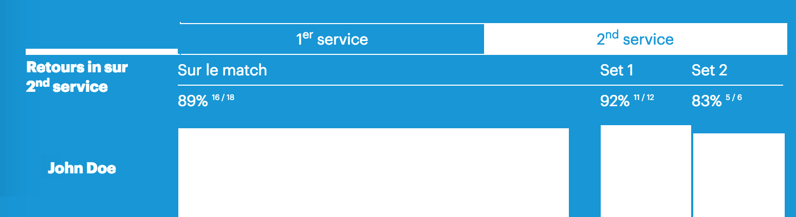

##MOJJO ANGULAR TEST##

This is a basic angular test in which you will have to create a directive to organize and display datas rendered by the an API.

You can run this single page app simply using ```python -m SimpleHTTPServer``` at the root of this repository.

As you will see, this basic app is consuming serves data from the JSON file, but we now need to organize it.



